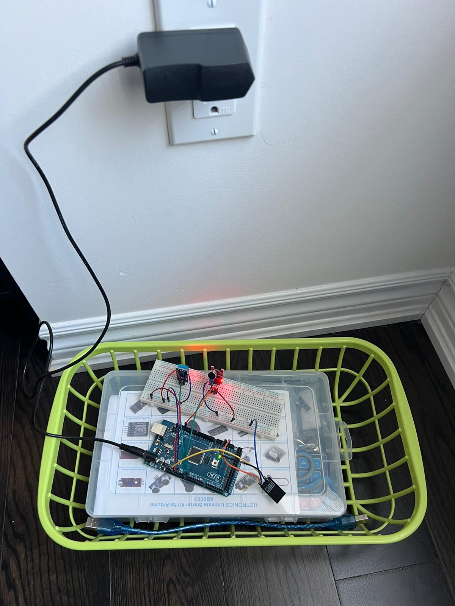

# Resources for Final Project - Better Sleep

1. Mobile APP Demonstration

   - [Demo](https://drive.google.com/file/d/1T6u0_gYNHW4cAcngJYV2j95wseggXWbG/view?usp=drive_link)

2. IOT Device Demonstration
    

     
   

3. IOT Video Demo

   - [Demo1](https://drive.google.com/file/d/1eOilktJP5pLlmttyjkDKp4yNSfXl0HQa/view?usp=drive_link)
   - [Demo2](https://drive.google.com/file/d/1mnrsSoxFRT8ENidNhhnpxqMMiZBX7W4w/view?usp=drive_link)

4. Code for the project can be found in the following repositories:

   - [IOTHomeSleepBetter_iOSAPP](https://github.com/iMilesHo/IOTHomeSleepBetter_iOSAPP.git)
   - [IOTHomeSleepBetter](https://github.com/darktalentCA/BETTERSLEEP/tree/main)
