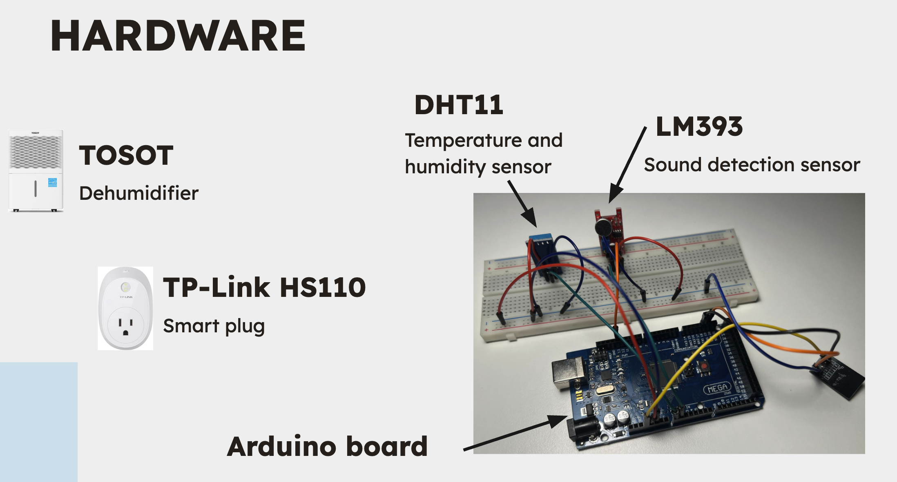
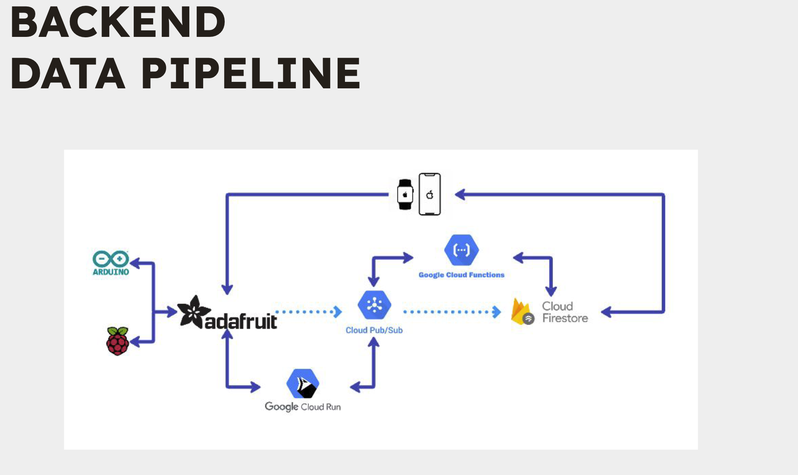
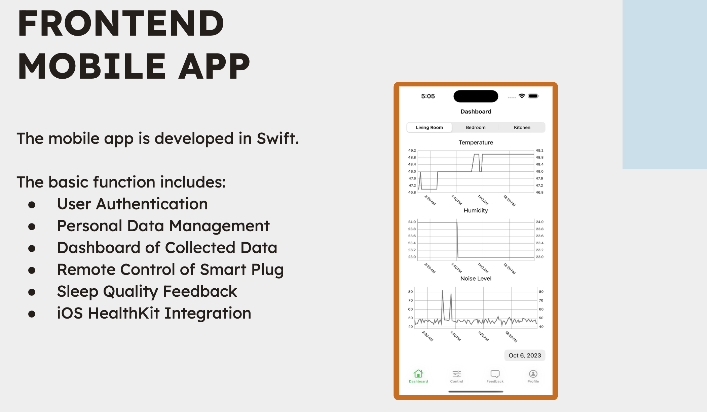
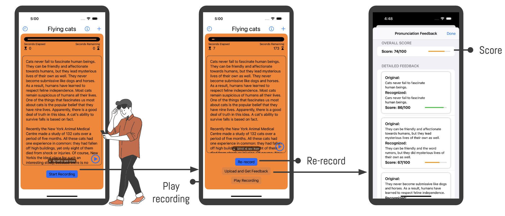

Hi There!

Here is a repository of projects on IOT and Deep Learning Applications. The projects originated from a course "Cyber Physical Systems", SEP 769, at McMaster University. The workshop was divided into two parts. The first part was on IOT and the second part was on IOT and Deep Learning Applications.

## Part 1: IOT

1. IOT devices:

    

2. IOT Architecture:

    

3. IOT Mobile App:

    

## Part 2: IOT and Deep Learning Applications

    

## Acknowledgement

Team Members:

- [Lyle He](https://github.com/iMilesHo)
- [darktalentCA](https://github.com/darktalentCA)
- [Angel Salazar]()
